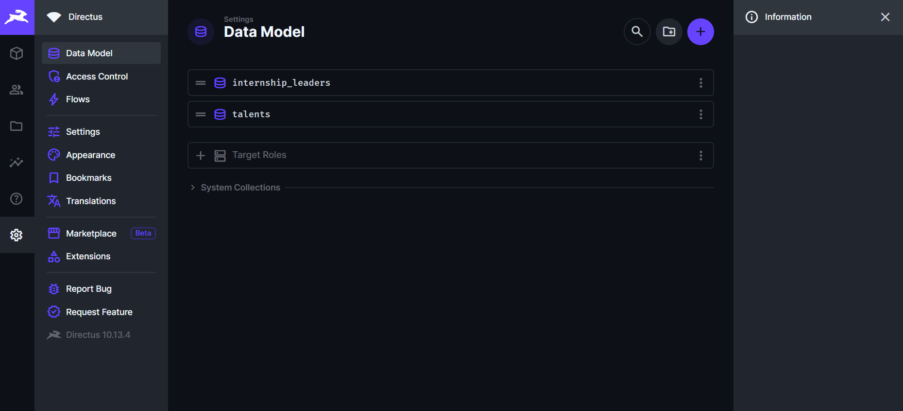
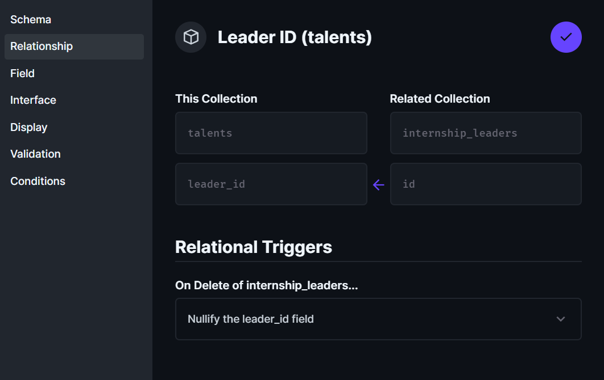
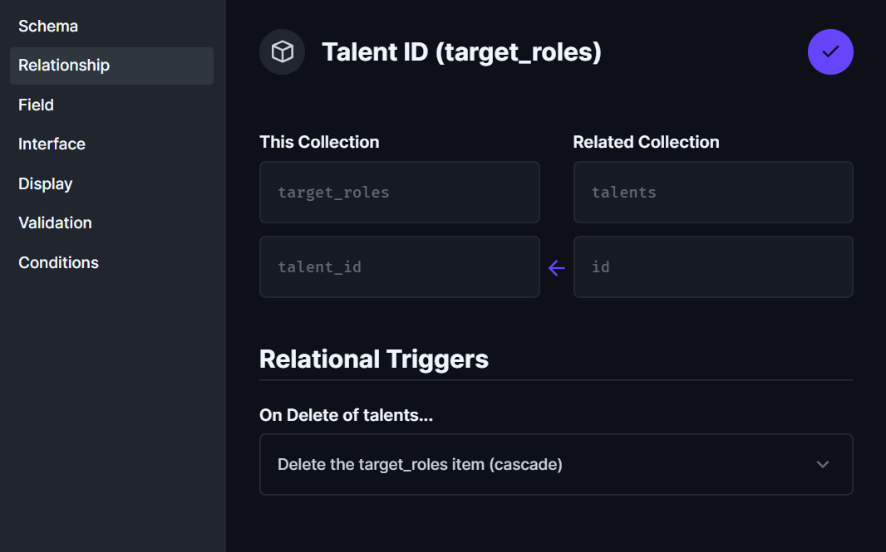
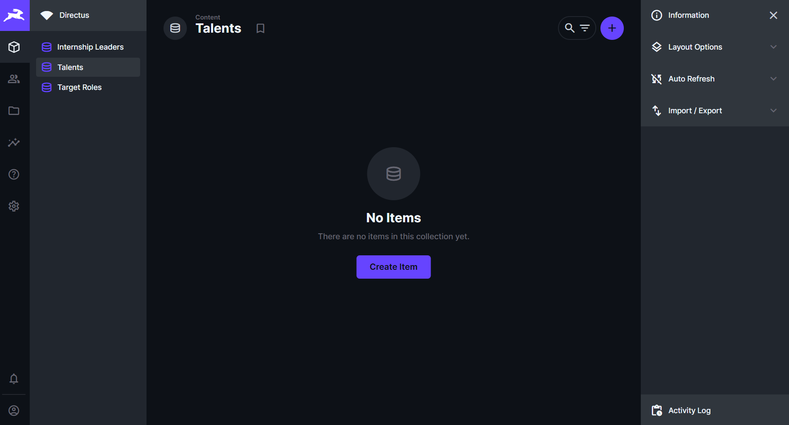

# 🚀 Desafio Técnico - Leapy - Interface Talent

## 🧠 Descrição
Implementação do modelo de dados do desafio **Interface Talent** usando **PostgreSQL** e **Directus**, com dockerização completa e relacionamentos entre as tabelas.

## 🧩 Estrutura do Projeto
- `internship_leaders`: cadastro dos líderes de estágio  
- `talents`: cadastro de talentos vinculados a líderes e cargos  
- `target_roles`: cargos almejados pelos talentos  

## 🔗 Relacionamentos criados
- `talents.leader_id → internship_leaders.id` → **SET NULL**
- `talents.target_role_id → target_roles.id` → **SET NULL**
- `target_roles.talent_id → talents.id` → **CASCADE**

## ⚙️ Como executar o projeto

### 1. Subir containers
```bash
docker-compose up -d

## 📸 Evidências

### 1️⃣ Data Model
Demonstração das coleções criadas no Directus (`internship_leaders`, `talents`, `target_roles`).



---

### 2️⃣ Relacionamento Leader → Talents
Mostra o relacionamento configurado entre as coleções `internship_leaders` e `talents`, com a opção **“Nullify the leader_id field”**.



---

### 3️⃣ Relacionamento Target Role → Talents
Mostra o relacionamento configurado entre `target_roles` e `talents`, com **delete em cascata (ON DELETE CASCADE)**.



---

### 4️⃣ Teste no Content
Demonstração da tela de conteúdo (`Content`) mostrando as coleções disponíveis e prontas para receber dados.



---

✅ **Status Final:**  
Todas as tabelas criadas, relacionamentos configurados e interface do Directus operacional.
